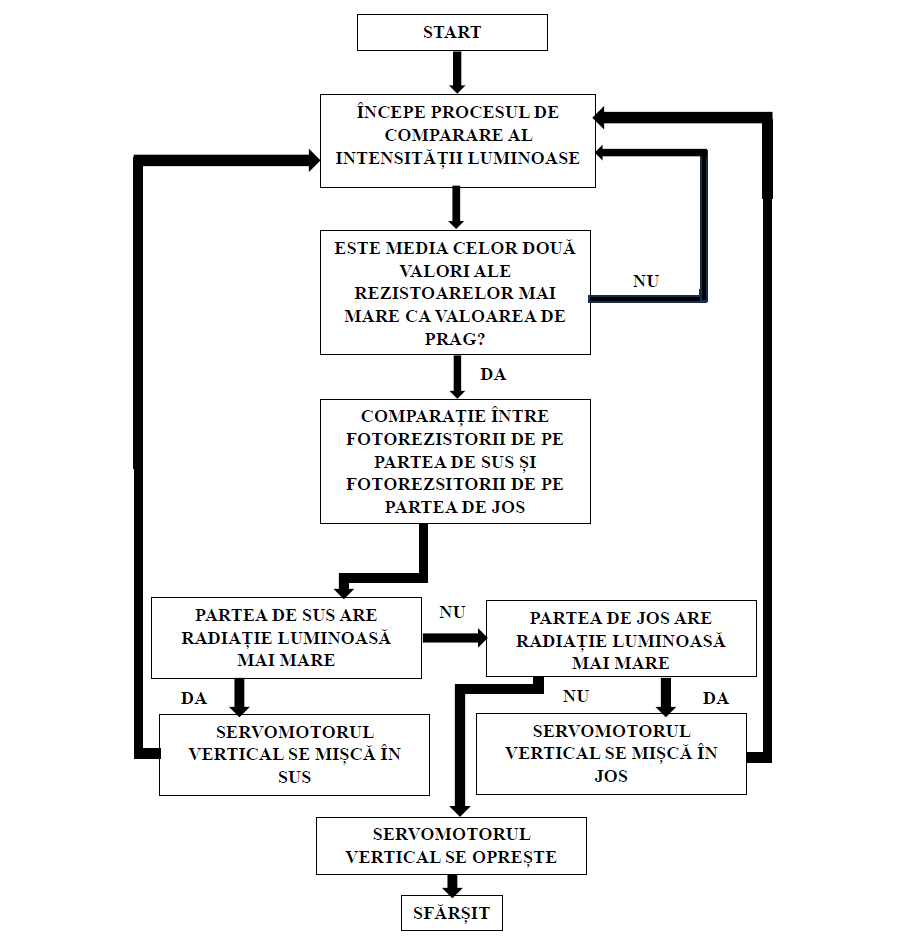
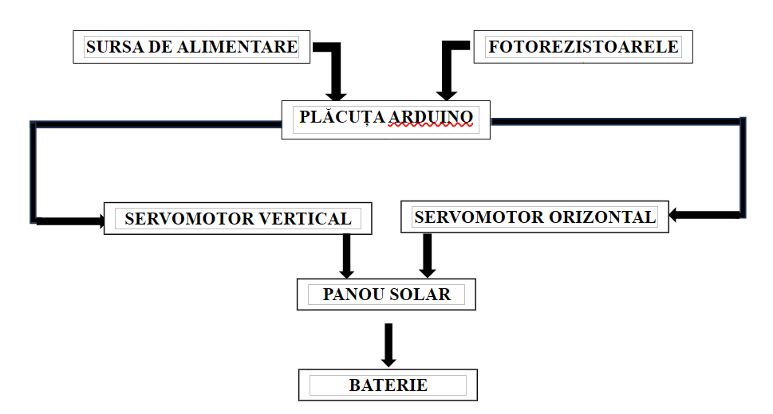
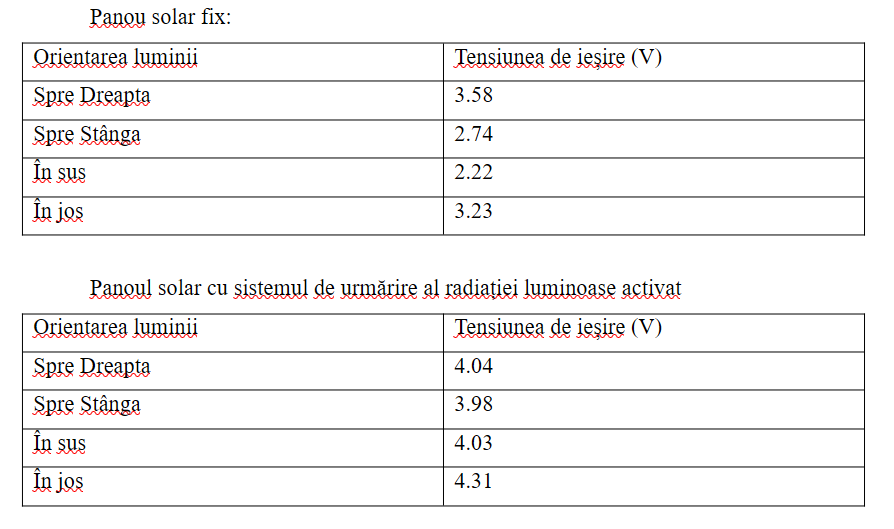

#Arduino-based Dual-Axis Solar Tracking System
An Arduino-based, Solar Tracking device that makes a Solar Panel follow the position of the Sun or other sources of light.  
The system moves the panel both vertically and horizontally, by taking analog information from 4 LDRs (all 4 cardinal directions) and converting them into digital values that are later used for servomotors' movement.
The movement logic is based on the following flowcharts:  
<table align="center">
<tr>
  <td align="center">
   
  Vertical Flowchart  
  </td>
    <td align="center">
   
  Circuit Flowchart  
  </td>
    <td align="center">
   
  Horizontal Flowchart  
  </td>
</tr>  
</table>

The goal of the Dual-Axis Solar Tracking System is to increase the power output of the Solar Panel attached, in comparison with a fixed one.  
The circuit has the following structure:  

  
  
Circuit Assembly

And the real-life structure is presented below:
<table align="center">
<tr>
  <td align="center">
   
  Front-side of the complete circuit
  </td>
    <td align="center">
   
  Back-side of the complete circuit  
  </td>
</tr>  
</table>

After complete assembly and testing (see "Testing" folder inside the repo) we did the experiment and the results are found below:

  
  
Circuit Assembly

Final conclusion: A dual-axis solar-tracking device does indeed increase the output power of a solar panel and also has the ability to fix problems that are common with fixed solar panels, such as cell shadowing.
